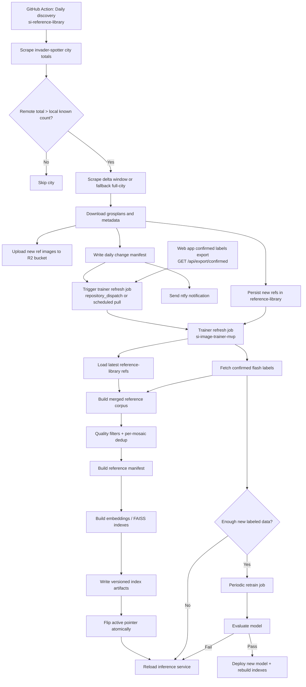

# Reference Corpus Automation Plan

Last updated: 25 May 2026, 18:16

## Goal

Automate the full path from newly discovered mosaics and crowd-confirmed flash labels to a refreshed retrieval corpus and deployed matching indexes.

This project has four main outcomes:

1. Detect new mosaics from invader-spotter daily.
2. Download their reference images and upload the serving assets to the reference image bucket on R2.
3. Merge those new references with crowd-confirmed flash labels from the web app.
4. Rebuild and deploy updated retrieval indexes, and retrain model weights on a slower cadence when justified.

## Repo Responsibilities

### si-reference-library

- Own daily invader-spotter discovery.
- Sync new mosaics into `references/<CITY>/<MOSAIC_ID>/`.
- Produce a machine-readable daily change manifest.
- Send notifications when new mosaics are found.
- Persist newly discovered refs back to git as the durable source of truth.

### si-image-wall

- Serve reference images from the R2 reference bucket.
- Provide the confirmed-label export endpoint.
- Continue to own D1 labels and consensus state.

### si-image-trainer-mvp

- Consume latest reference-library state.
- Consume crowd-confirmed flash labels via the web app export endpoint.
- Build the merged reference corpus.
- Rebuild and publish updated indexes.
- Reload inference to use the new indexes.
- Retrain the embedding model on a separate, less frequent cadence.

## Recommended Pipelines

### Pipeline A: Daily Discovery

Scheduler: GitHub Actions in `si-reference-library`

Purpose:

- Refresh invader-spotter city totals.
- Compare remote totals with local known counts.
- Scrape only cities with a positive delta.
- Download grosplans and metadata for newly discovered mosaics.
- Upload new reference images to the R2 ref bucket.
- Emit a daily report / manifest.
- Send ntfy notifications.
- Commit and push new reference-library changes back to the canonical repo.

### Pipeline B: Daily Corpus Refresh

Scheduler: GitHub Actions or Modal entrypoint in `si-image-trainer-mvp`

Purpose:

- Pull latest reference-library refs.
- Pull crowd-confirmed flash labels from the web app export endpoint.
- Build a merged reference manifest.
- Apply quality filters and per-mosaic deduplication.
- Rebuild city-scoped retrieval indexes.
- Publish indexes atomically.
- Reload inference to use the new indexes.

### Pipeline C: Periodic Model Retraining

Scheduler: weekly or threshold-based in `si-image-trainer-mvp`

Purpose:

- Retrain or fine-tune model weights using accumulated labeled data.
- Run evaluation gates.
- Deploy new model weights only if quality improves or remains acceptable.

This pipeline should not run daily by default.

## Why Index Refresh Is Separate From Retraining

Adding new reference images improves coverage immediately and usually does not require a new model. Most short-term gains come from a better corpus and refreshed indexes, not from daily weight retraining.

Recommended cadence:

- Daily: discovery, corpus refresh, index rebuild, index deployment.
- Threshold-based model retraining: if there is at least one new mosaic, or 100 new labels.

### Git-backed Persistence

The reference-library repo is the canonical store for newly discovered refs.

The daily discovery workflow should:

- write new and updated `references/<CITY>/<MOSAIC_ID>/...` files locally
- commit those changes in CI when the run finds new refs
- push the commit back to the default branch so the repo remains authoritative

## Source Of Truth

The recommended durable source of truth for newly discovered references is the `si-reference-library` repo itself.

That means the daily discovery pipeline should eventually persist:

- new `references/<CITY>/<MOSAIC_ID>/metadata.json`
- downloaded grosplan files and any retained auxiliary images
- the daily report for auditability if needed

R2 should be treated as a serving destination, not the only canonical store of reference metadata.

## Crowd-Sourced Labels Input

The trainer-side refresh job should consume crowd-confirmed labels through the web app export contract, not by reading D1 directly.

Preferred input:

- `GET /api/export/confirmed?since=...`

Reason:

- keeps the trainer pipeline decoupled from raw D1 schema details
- preserves the documented API boundary between repos
- allows stateless web-side export behavior

## Flow Diagram

## Milestones

### Milestone 1: Stable Daily Discovery

- Daily invader-spotter check runs reliably.
- Delta-tail scraping works for large cities.
- Broken image downloads do not abort the run.
- A daily report is produced.
- New refs are uploaded to R2.

### Milestone 2: Durable Ref Persistence

- Newly discovered refs are stored durably.
- Canonical metadata lives in the repo, not only in CI workspace.
- Daily changes are auditable.

### Milestone 3: Automated Corpus Refresh

- Trainer job consumes reference-library refs and confirmed labels.
- Merged corpus is rebuilt daily.
- Retrieval indexes are rebuilt automatically.
- Index publication is atomic.

### Milestone 4: Periodic Retraining

- Threshold or weekly retrain trigger exists.
- Evaluation gate exists.
- Model rollout is separated from daily index refresh.

## Update Rule

Whenever a task in this project is completed, update both:

- `docs/ref-corpus-automation-plan.md` if the architecture or operating model changed
- `docs/ref-corpus-status.md` if the status of a task changed

The status tracker stores human-readable local timestamps for completed and recently updated rows.
